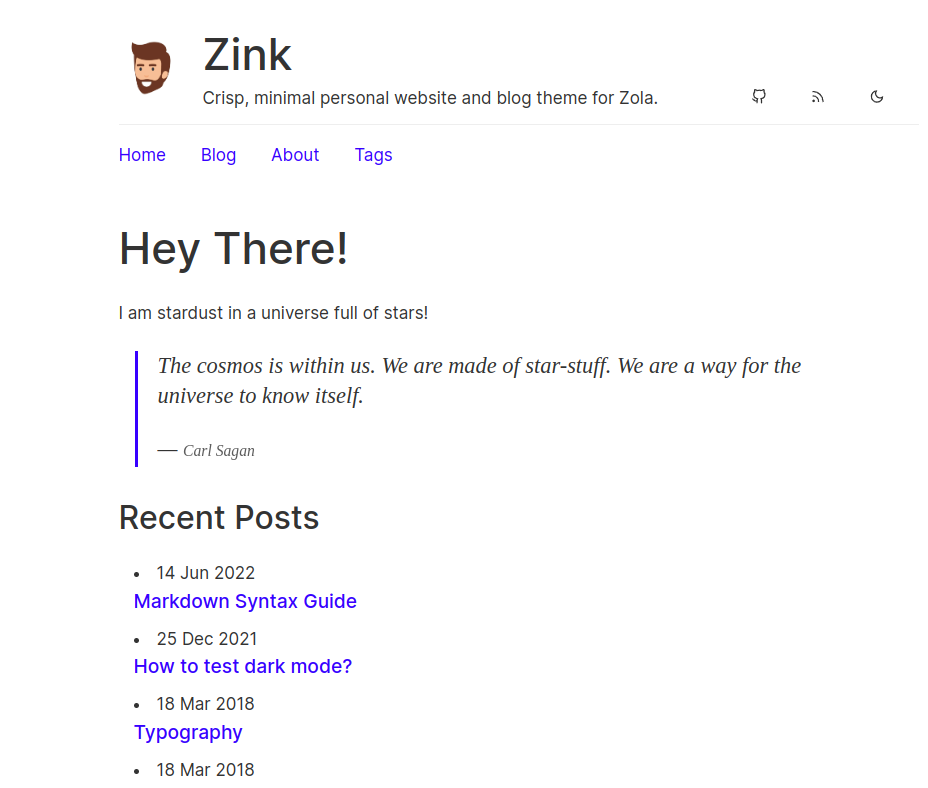
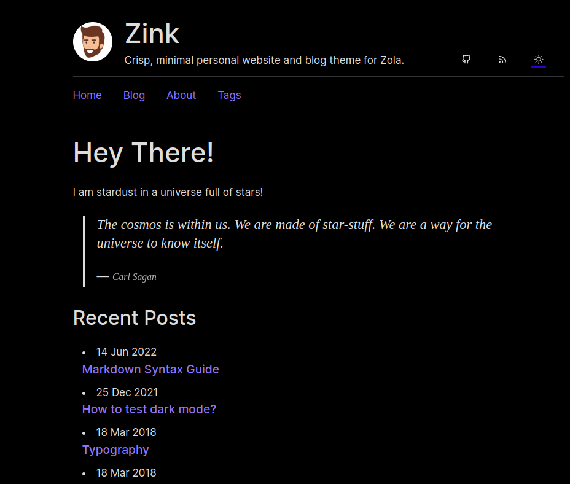

# Zink

Crisp, minimal personal website and blog theme for Zola. This is a port of [hugo-ink](https://github.com/knadh/hugo-ink) which was originally forked from [Ezhil](https://github.com/vividvilla/ezhil).

The name is inspired by `zola` and `ink`.

### Ligh theme


### Dark theme


## Installation

1. Download the theme
```
git submodule add https://github.com/varunlakkur/zink themes/zink
```
2. Add `theme="zink"` to your `config.toml`
3. Copy example content from theme to the main content
```
cp -r themes/zink/content/* content/
```
4. Add `theme=zink` to the main section of `config.toml`

### Override
You can override the contents of the main page by extending the `index.html` file.
```html



Your new content goes here

```
Analytics can be added by extending the analytics block
```html



Your new content goes here

```

## Options
All the options go into `[extra]` section

#### zink_avatar _(optional)_:
Avatar to be displayed on beside the site title

####zink_social:
Links to your SM profiles like twitter and github

**Example:**
```toml
zink_social = [
    {url = "https://github.com/varunlakkur/zola", name = "Github", icon = "github"},
    {url = "atom.xml", name = "RSS", icon = "rss"},
]
```

#### zink_links:
The menu items to be displayed on the nav bar.

**Example:**
```toml
zink_links = [
    {url = "/", name = "Home"},
    {url = "/blog", name = "Blog"},
    {url = "/about", name = "About"},
    {url = "/tags", name = "Tags"},
]
```

#### zink_recent:
Decides whether to display the Recent Posts on the main page

#### zink_recent_items _(Optional)_:
Num of recent posts to be displayed.

## Acknowledgements
- Ported [hugo-ink](https://github.com/knadh/hugo-ink) with `zola` specific changes
    - The layout and the theme is identical to `ink`
    - The css files and js files are from ink (Thanks [knadh](https://github.com/knadh))
- Skeleton of the templates are taken from [mr-karan](https://github.com/mr-karan)'s [website](https://github.com/mr-karan/website)
